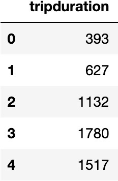
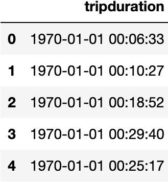
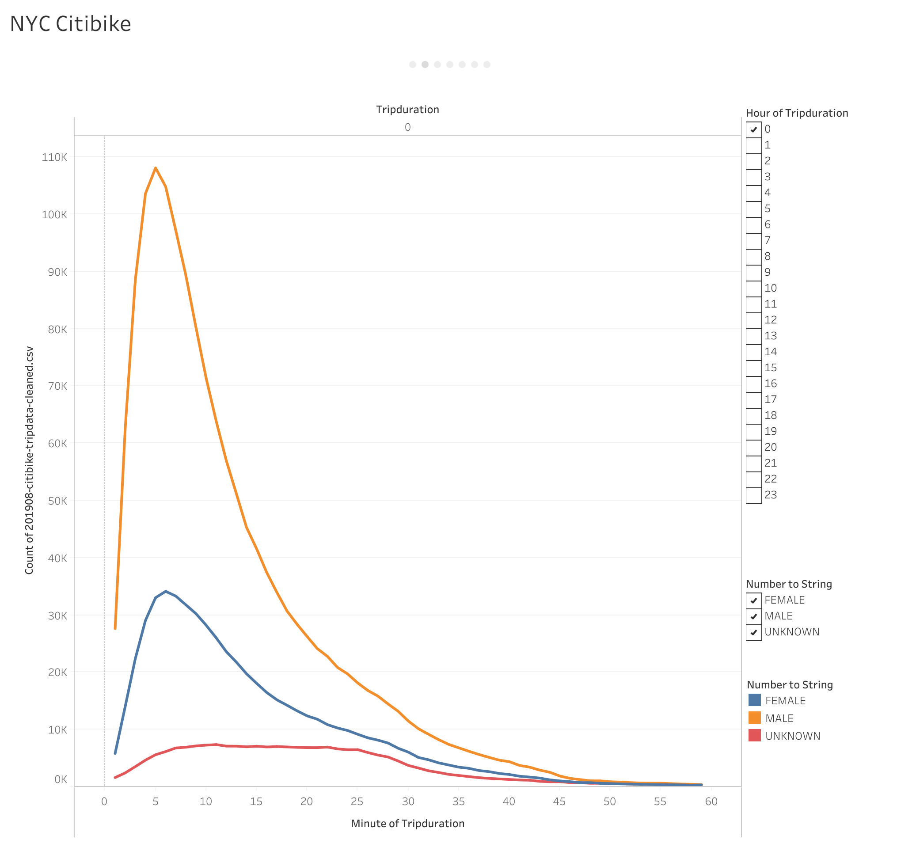
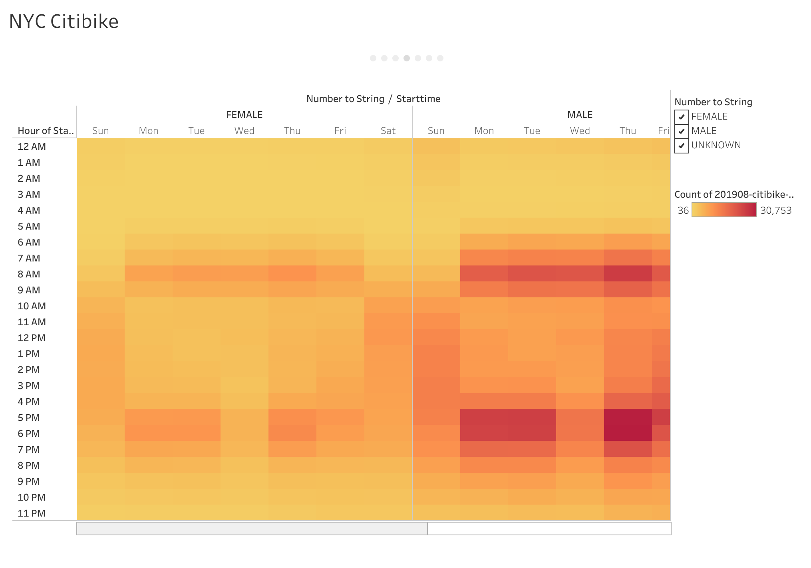
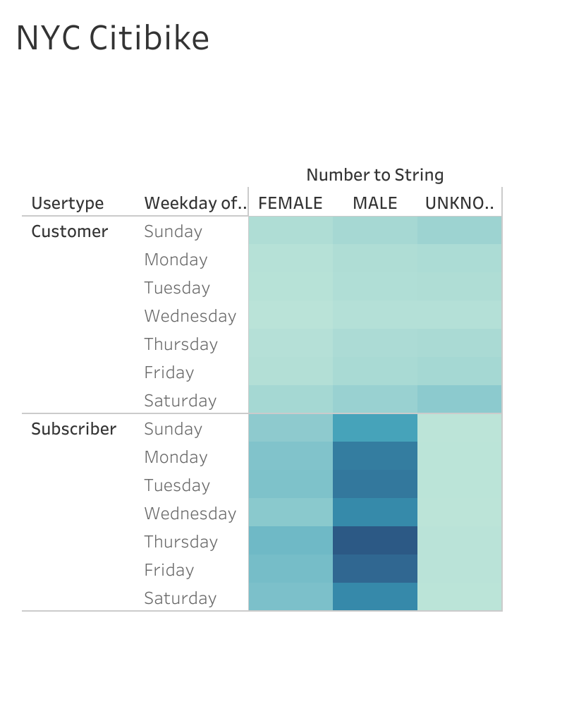
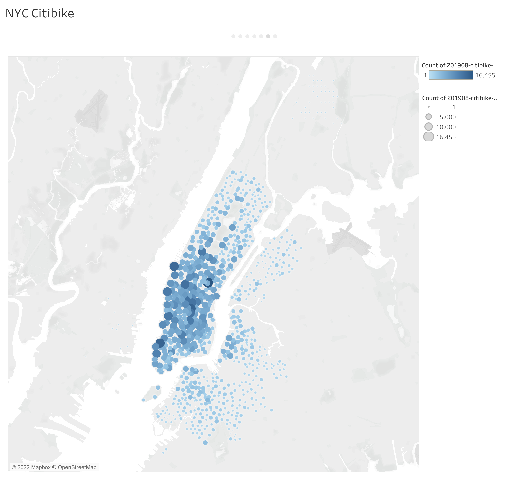
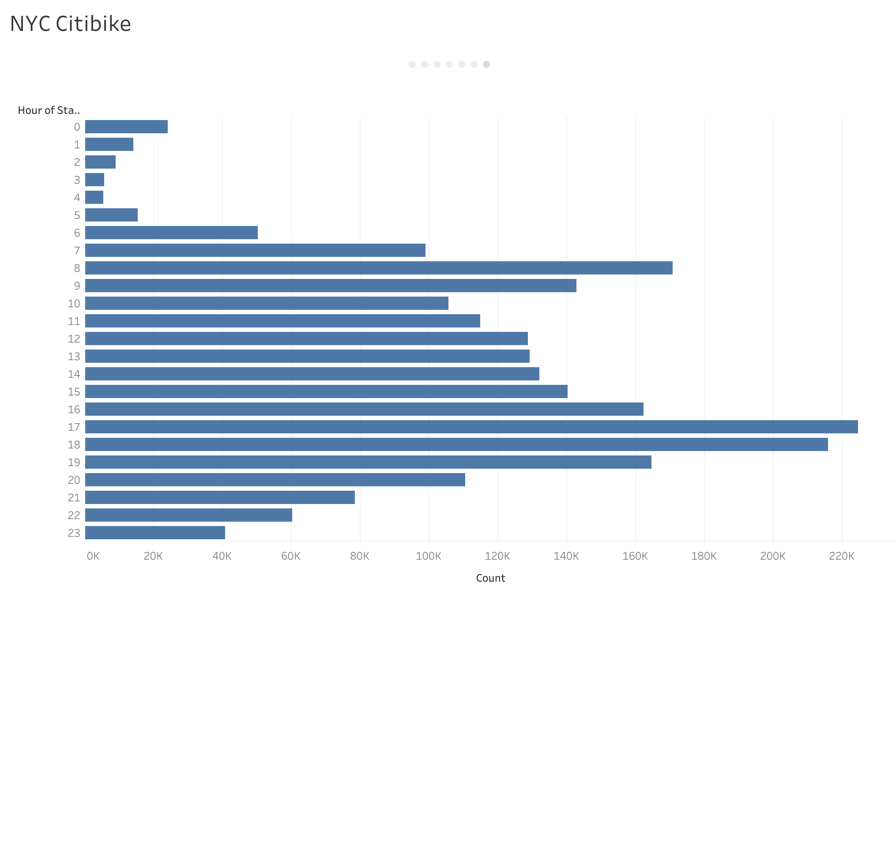

# bikesharing

[link to dashboard](https://public.tableau.com/app/profile/nate.lewis5231/viz/NYCCitibikeAnalysis_16496318863460/NYCCitibike?publish=yes)

## Overview

The purpose of this analysis is to construct a business proposal for Kate's bike-sharing company in Des Monies. We will be working with data from the Citi Bike program in New York City to help predict if Kate's desired location could produce a successful business. Kate suggests working within the data visualization software called Tableau. It's primary purpose is to deliver insights beyond those captured by spreadsheets. Tableau is undoubtedly the leader in the data viz space.

## Results

Before beginning our analysis, we must first clean our dataset. The `tripduration` column is initially stored with the `int64` dtype. We will use Pandas to transform the `tripduration` variable into a datetime datatype.

Original           |  Cleaned
:-------------------------:|:-------------------------:
|

We next want to generate some questions that should inspire a set of visualizations.

##### How long bikes are checked out?

##### How many trips are taken by the hour for each day of the week?

##### What days of the week a user might be more likely to check out a bike?

##### What are the top bike stations for ending a journey?

##### What are peak riding hours in the month of August?

